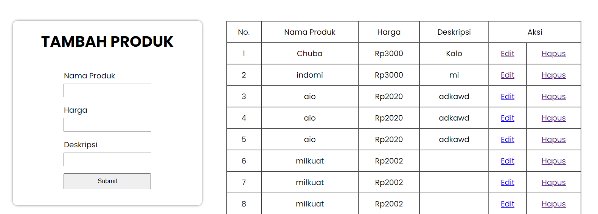

# APLIKASI SEDERHANA CRUD PRODUK



**CRUD Produk** adalah aplikasi sederhana berbasis web yang memungkinkan pengguna untuk menambah, melihat, mengedit, dan menghapus data produk. Aplikasi ini cocok untuk digunakan dalam mengelola daftar produk secara sederhana dan cepat.

## Fitur
- **Create**: Tambahkan produk baru dengan nama, harga, dan deskripsi.
- **Read**: Lihat daftar produk yang sudah ditambahkan beserta detailnya.
- **Update**: Edit informasi produk yang sudah ada.
- **Delete**: Hapus produk dari daftar.

## Cara Memakai
1. Masukkan nama, harga, dan deskripsi produk di bagian ``` Kotak ```.
2. Klik tombol ``` Submit ``` untuk menambahkan produk ke daftar.
3. Setelah produk berhasil ditambahkan, akan muncul informasi ```Nama Produk```, ```Harga```, dan ```Deskripsi``` di tabel daftar produk.
4. Kamu juga bisa melakukan aksi **Edit** dan **Delete** pada produk yang ada di daftar.

## Teknologi yang Digunakan
- HTML
- CSS
- PHP 
- SQLite
